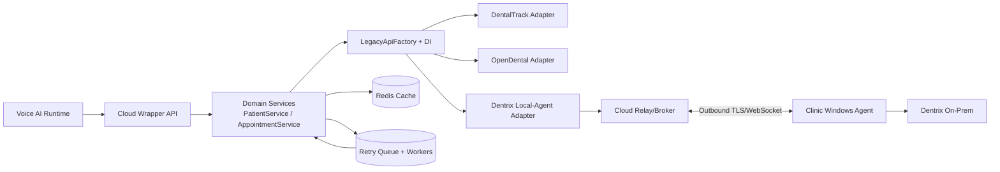

# SYSTEM_DESIGN.md

## Scope and Assumptions

This design addresses how to evolve the current single-PMS wrapper into a multi-PMS platform for live voice workflows.

Assumptions used here:

- Dentrix is primarily an on-prem Windows desktop PMS with no straightforward public cloud API for direct cloud-to-clinic calls.
- OpenDental provides a documented API and is easier to integrate from the cloud when deployment/network constraints permit.
- Live phone calls need low-latency paths for read operations and safe/idempotent semantics for writes.

Given time limits, this document focuses on practical implementation direction and explicit trade-offs.

---

## 1) Multi-PMS Architecture

### Current foundation

The current code already follows the right layering:

- thin API routers
- single-responsibility internal services (`PatientService`, `AppointmentService`)
- one integration boundary (`DentalTrackApiQueryService`)

### First change I would make next

Introduce a dependency injection framework with auto-wiring support (for example, a Python DI container that supports provider wiring and runtime resolution).

Why first:

- clean composition root
- easier per-tenant adapter selection
- simpler testing/mocking of adapter implementations

### Target abstraction

Define a protocol/interface:

- `LegacyApiQueryService` (contract)

Implementations:

- `DentalTrackApiQueryService`
- `OpenDentalApiQueryService`
- `DentrixLocalAgentQueryService`
- future adapters as needed

### Runtime adapter selection

Use `LegacyApiFactory` + DI:

Inputs for selection:

- tenant PMS type
- subscription plan/features
- clinic settings/network mode
- enabled service modules

Flow:

1. Request enters API.
2. Domain service asks factory for `LegacyApiQueryService` for tenant context.
3. Factory resolves concrete implementation via DI providers.
4. Service executes business flow against interface only.

Result:

- extensibility is isolated to new `LegacyApiQueryService` implementations
- most of the system remains unchanged when adding a PMS

---

## 2) On-Premise Problem (Dentrix)

### What makes Dentrix hard

- app runs inside clinic network/on Windows desktop infrastructure
- cloud service cannot reliably call clinic LAN services directly
- inbound firewall openings are risky and operationally expensive

### Options considered

1. **Direct inbound exposure (not recommended)**
   - high security risk
   - brittle networking
2. **Site-to-site VPN to each clinic**
   - secure but heavy operational overhead per clinic
3. **Local Agent + Outbound Tunnel (recommended)**
   - best balance of security, operability, and scale

### Recommended approach now

Use a **Local Agent + Outbound Tunnel** model:

- install a lightweight Windows service agent in clinic
- agent opens persistent outbound TLS/WebSocket connection to cloud relay/broker
- cloud sends requests to agent over this channel
- agent translates and executes clinic-local integration steps against Dentrix-accessible surfaces

### Deployment and updates

- MSI installer for agent
- auto-update channel with signed binaries
- staged rollout rings (pilot tenants first)
- rollback support

### Authentication and security

- mTLS between agent and cloud broker
- short-lived service tokens (rotate automatically)
- per-tenant scoped credentials
- no inbound public ports at clinic

### Internet drop during calls

- agent heartbeat marks clinic connectivity status
- for read requests: use cloud cache with staleness labels
- for write requests: queue with explicit confirmation semantics
- voice orchestration receives explicit degraded-state signals and fallback prompts

### Research note

Dentrix specifics (supported extension surfaces, database access boundaries, vendor partner requirements, legal/compliance constraints) need dedicated implementation discovery with vendor docs/partner channels before finalizing the connector internals.

---

## 3) Canonical Data Model

### Principle

The interface contract defines canonical models; each adapter maps PMS-native formats into those models.

Canonical entities for this use case:

- Patient
  - `patient_id`, names, normalized phone, DOB, insurance flag, last visit
- Availability slot
  - `date`, `time`, `dentist_id`, `dentist_name`
- Booking
  - request: patient/dentist/date/time/reason
  - response: appointment id, confirmation number, status

### Responsibility split

- Domain services depend on canonical models only.
- Adapter implementations perform mapping and normalization.

### Adapter implementation style

- deterministic field-level mapping rules per PMS
- compatibility mappers for version drift
- optional adapter-specific transformation pipelines

### LLM-assisted mapping (future option)

Possible exploration area:

- use LLMs for schema/field mapping assistance during adapter development

Constraints:

- cost control
- determinism requirements in production request path
- safety/validation guardrails

Recommendation:

- keep production runtime mapping deterministic
- use LLMs mainly for tooling/accelerated development or offline mapping suggestions

---

## 4) Reliability During Live Calls

### Current direction in code

Intentional caching + retries already mitigate legacy slowness and random upstream failures.

### Next production step

Replace in-memory caches with distributed cache (Redis or equivalent) with per-entity TTLs.

### Degradation policy

- hard realtime read path budget (example: 5s max)
- if upstream misses budget:
  - try cache
  - if cache miss and non-critical request: return graceful fallback to voice layer
  - if critical write: enqueue and inform caller with explicit next-step language

### Queue-based resilience

Introduce asynchronous retry pipeline:

- enqueue failed operations with idempotency key
- worker retries with backoff and DLQ
- notify downstream systems on success/final failure

Use cases:

- temporary PMS outage
- clinic network interruption
- transient broker failures

### Failure behavior matrix

- **Patient lookup**: stale cache acceptable within bounded TTL
- **Availability**: short TTL, stale tolerated briefly with caveat
- **Booking**: strong idempotency required; conflict and commit semantics explicit

---

## 5) Database and Caching Strategy

### What to store on our side

- tenant/PMS configuration and adapter selection metadata
- idempotency records (write operations)
- short-lived query caches
- request/response audit metadata (PHI-safe policy enforcement)

### What to fetch real-time

- highly volatile operational data, especially final booking commit checks

### TTL strategy (example)

- patient-by-phone: longer TTL (minutes to hours, policy-based)
- provider availability: short TTL (seconds to low minutes)
- booking write idempotency records: longer retention window (hours to days)

### Consistency trade-offs

- stale read is acceptable for conversational guidance with guardrails
- stale write is dangerous for booking confirmation
- booking path should always do final conflict/commit verification against source of truth before confirmation

---

## Reference Architecture (logical)

---

## What I would do next with more time

1. Add DI container and composition root.
2. Define `LegacyApiQueryService` protocol explicitly and refactor current adapter to implement it.
3. Build `LegacyApiFactory` with tenant-aware resolution.
4. Replace in-memory cache/idempotency with Redis + persistence-backed idempotency store.
5. Design and prototype Dentrix local agent + relay handshake and health model.
6. Add SLOs/metrics/tracing and runbook for degraded call handling.
